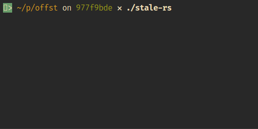

# Find stale (unlinked) .rs files

This script will find .rs files that are safe to delete (they are not mentioned by any `mod <...>;`).

## Requirements

- cargo
- fd-find

If you want to use Rust toolchain other than default, create a `rust-toolchain` file
with content like `nightly-2019-04-01`. Then `rustup` will automatically (download and) use it for
all `rustc` and `cargo` commands.

## Usage

Copy `stale-rs` file to your Rust project directory, or add this script to `PATH`. Then run it.

False positives may happen if a file is used only when certain feature flag is toggled.

The script works by renaming files and checking if `cargo check --all-targets` still work.
If you pause the script or it crashes, you may find `.rs.hiding` files. Remove the `.hiding`
extension to recover.
